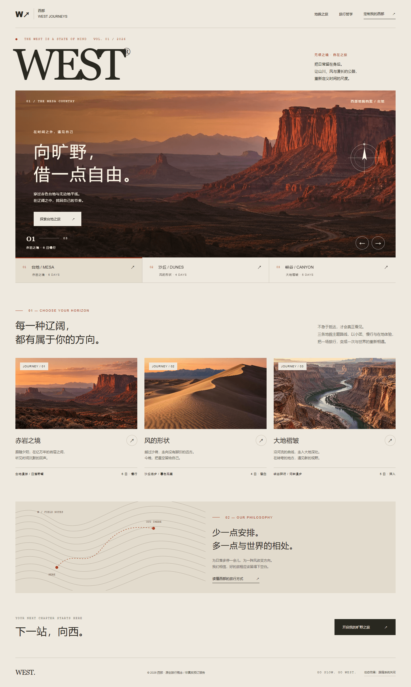
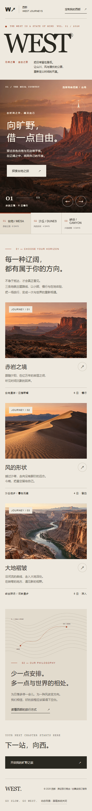

# 西部 WEST — 向旷野，借一点自由

> 原创高级网页概念设计 · 2026-09-30

**[▶ 在线预览](https://sallygong310-lily.github.io/west-beyond/)**

一个高端西部旅行概念站：小团、慢行、在地停留。整站为**单文件离线原型**——双击 `WEST.html` 即可运行，CSS、JavaScript 与三张图片全部内嵌，无需服务器、无需安装依赖、无需联网。

## 预览

| 桌面 1440px | 手机 390px |
|:---:|:---:|
|  |  |

## 交互

- 点击主视觉左右箭头或地貌条，在**台地 / 沙丘 / 峡谷**之间切换。
- Tab 聚焦主视觉后，用 `←` / `→` 切换，`Home` / `End` 跳到首尾；触屏可左右滑动。
- 图片以方向性遮罩揭示；鼠标移动时背景、文案与罗盘分层位移，滚动时背景轻微视差。
- 尊重系统 `prefers-reduced-motion`，自动关闭遮罩动画与视差；页脚也可手动关闭动态。**没有自动播放**。
- `Tab` / `Shift+Tab` 遍历控件，`Enter` / `Space` 激活按钮，`Esc` 关闭对话框；关闭后焦点返回入口。
- 点击「定制我的西部」或各路线按钮，选择月份与人数，生成并下载本地行程意向单。演示不联网、不预订、不发送表单。
- 「读懂西部的旅行方式」打开可操作的品牌说明。

## 文件

| 文件 | 说明 |
| --- | --- |
| `WEST.html` | 单文件离线原型（交付主件） |
| `index.html` | 在线预览入口，跳转到 `WEST.html` |
| `WEST-desktop-editable.svg` | 桌面可编辑稿，画布宽 1440 px |
| `WEST-mobile-editable.svg` | 手机可编辑稿，画布宽 390 px |
| `preview-desktop.png` / `preview-mobile.png` | 实际原型预览截图 |
| `assets/01-mesa.jpg`、`02-dunes.jpg`、`03-canyon.jpg` | 本地原创图片 |
| `使用说明.txt` | 完整使用与导入说明 |
| `图片来源与生成记录.txt` | 图像来源与生成提示词 |
| `verification.json` | 功能检查记录 |
| `交付清单.txt` | 文件及完整性信息（含 SHA-256） |

## 设计逻辑

- **品牌**：小团、慢行、在地停留的高端西部旅行概念。
- **情绪**：安静、自由、地质时间感。刻意避免堆叠西部片符号。
- **视觉**：沙色纸张 `#EEE9DF`、炭黑 `#292820`、朱砂 `#A64025`；衬线大字 WEST、中文克制留白、等宽档案编号、地形线与坐标罗盘。
- **层级**：品牌宣言 → 沉浸地貌 → 路线对比 → 旅行哲学 → 定制入口。
- **转化**：先选择地貌，再选择月份/人数，生成可带走的本地意向单；主视觉入口跟随当前轮播主题，减少重复选择。
- **节奏**：手动推进，不自动打断阅读；遮罩 850 ms；视差小幅、分层，减少动态模式下立即切换。
- **手机**：保留主视觉与三项切换，路线卡片单列，定制入口始终可在页首找到。

## Figma 导入

在 Figma 中拖入 `WEST-desktop-editable.svg` 或 `WEST-mobile-editable.svg` 即可。页面使用原生 SVG `<text>`、路径、矩形、线条与圆形，**文字未转曲**，可逐层编辑；等高线与罗盘为原创矢量，照片为内嵌 JPEG。

主要字体：Georgia、Arial、Microsoft YaHei（微软雅黑）、Courier New。Windows 通常自带；若 Figma 提示缺字，请安装/启用对应系统字体，或将中文替换为思源黑体并复核换行。

SVG 导入后为普通图层，未创建 Figma 原生自动布局、变量或交互连线——**交互以 HTML 为准**。

## 图片

三张地貌图均为本次新生成（OpenAI 内置 image_gen），无第三方图库素材，没有引用远程图片、远程字体、外部脚本或统计服务。图像为虚构地貌表达，不代表真实线路或精确地点。详细提示词见 `图片来源与生成记录.txt`。

## 校验

`verification.json` 记录了 Chrome / Playwright 下的 18 项功能检查，全部通过，且**无外部网络请求、无运行时错误**；桌面与手机 SVG 的 XML 结构有效（文本、路径、内嵌图片均正常）。`WEST.html` 的 SHA-256 为 `66e4c92f2987d710536035ba8a52a61271b9a25af60b6eea6ef90128d541f731`。